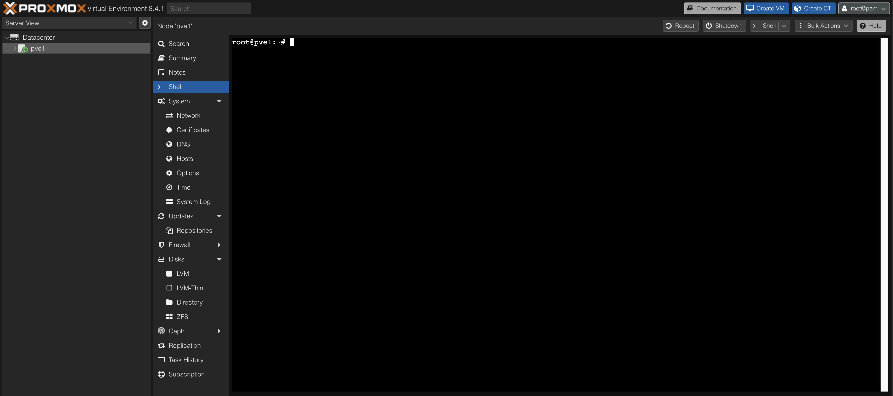
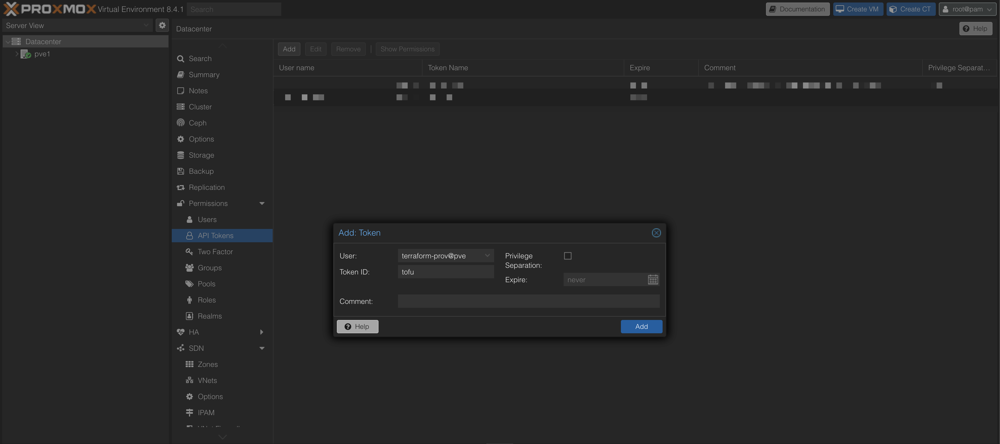
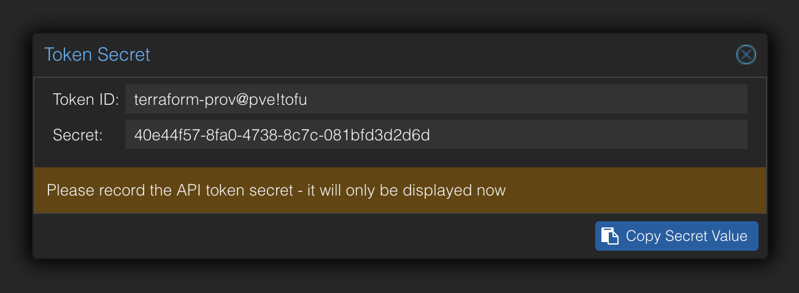
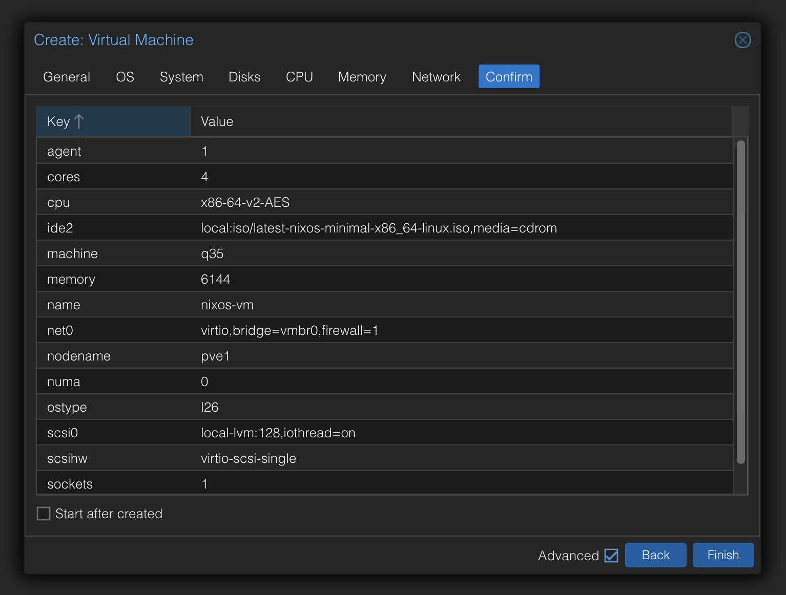

import { FileTree } from "@astrojs/starlight/components";
import { Steps } from "@astrojs/starlight/components";
import { Tabs, TabItem } from "@astrojs/starlight/components";

OpenTofu is a powerful tool for managing infrastructure as code. In this section, we'll walk through the steps to set up OpenTofu for building a NixOS VM on Proxmox.

## Prerequisites

- **Proxmox**: Ensure you have a Proxmox server set up and accessible.
- **OpenTofu**: Install OpenTofu on your local machine. You can follow the [installation guide](https://opentofu.org/docs/intro/install/) for detailed instructions.
- **NixOS ISO**: Download the latest minimal [NixOS ISO](https://nixos.org/download/) image and upload it to your Proxmox server. See this [guide](../upload-iso-proxmox) for instructions on how to upload the ISO.

## OpenTofu Configuration

Before starting to write OpenTofu configuration, we need to set up a couple of things in Proxmox to allow OpenTofu to manage your Proxmox resources.

### Create the Proxmox user, role and token for OpenTofu

To allow OpenTofu to manage your Proxmox resources, you need to create a user and assign it the necessary permissions. Follow these steps:

<Steps>

1. Log in to your Proxmox web interface.

2. Navigate to **Datacenter** > **_Node_** > **Shell**.

   

3. Run the following commands to create a new user and assign it a role:

   ```bash

   pveum role add TerraformProv -privs "Datastore.AllocateSpace Datastore.AllocateTemplate Datastore.Audit Pool.Allocate Sys.Audit Sys.Console Sys.Modify VM.Allocate VM.Audit VM.Clone VM.Config.CDROM VM.Config.Cloudinit VM.Config.CPU VM.Config.Disk VM.Config.HWType VM.Config.Memory VM.Config.Network VM.Config.Options VM.Migrate VM.Monitor VM.PowerMgmt SDN.Use"
   pveum user add terraform-prov@pve --password <password>
   pveum aclmod / -user terraform-prov@pve -role TerraformProv

   ```

4. Create a token for the user:

   Navigate to **Datacenter** > **Permissions** > **API Tokens** and click on **Add**.

   Select the previously created user (`terraform-prov@pve`), give the token a name (e.g., `tofu`), untick the `Privilege Separation` and set an expiration date and comment if desired.

   

   You will receive a token ID and a secret. Save these securely, as you will need them for your OpenTofu configuration.

   

</Steps>

### Create a NixOS VM

To simplify the process of managing the NixOS VM, we will first create a basic NixOS VM using the Proxmox web interface. This VM will serve as a template for our OpenTofu configuration.

<Steps>

1. In the Proxmox web interface, on the top right corner, click on **Create VM**.

2. Fill in the following details (you can adjust as needed) and leave the rest as default:

   | Tab         | Setting      | Value      | Notes                                     |
   | ----------- | ------------ | ---------- | ----------------------------------------- |
   | **General** | Name         | `nixos-vm` | Set a name for the VM                     |
   | **OS**      | ISO Image    | NixOS ISO  | Select the NixOS ISO you uploaded earlier |
   | **System**  | Qemu Agent   | ✓ Selected | Enable Qemu Agent                         |
   | **System**  | Machine      | `q35`      | Modern chipset with PCIe support          |
   | **Disks**   | Disk Size    | `128G`     | Set the disk size                         |
   | **CPU**     | Cores        | `4`        | Set the number of CPU cores               |
   | **Memory**  | Memory (MiB) | `6144`     | Set the memory size                       |
   | **Network** | Model        | `VirtIO`   | Use VirtIO for better performance         |

   You should see a summary of your VM configuration like this:

   

3. Click on **Finish** to create the VM.

</Steps>

### Write configuration files

Now that we have the Proxmox user, role, and token set up, and a basic NixOS VM created, we can write the OpenTofu configuration files.

<Steps>

1.  Create a directory for your OpenTofu configuration files, e.g., `opentofu`, and create the following files:

    <FileTree>

    - opentofu
      - imports.tf            // File to import existing Proxmox VM
      - opentofu.auto.tfvars  // File containing secrets
      - providers.tf          // File to configure the Proxmox provider
      - variables.tf          // File to define OpenTofu variables

    </FileTree>

2.  To interact with Proxmox using OpenTofu, you need to set up the Proxmox provider. Update the file named `providers.tf` with the following content:

    ```hcl
    // providers.tf

    terraform {
      required_providers {
        proxmox = {
          source  = "Telmate/proxmox"
          version = "3.0.1-rc8"
        }
      }
    }

    provider "proxmox" {
      # Configuration options

    }

    ```

    Run the following command to download the Proxmox provider:

    ```bash

     tofu init

    ```

    Expected output:

    ```bash frame="none"

    Initializing the backend...

    Initializing provider plugins...

    - Finding telmate/proxmox versions matching "3.0.1-rc8"...
    - Installing telmate/proxmox v3.0.1-rc8...
    - Installed telmate/proxmox v3.0.1-rc8. Signature validation was skipped due to the registry not containing GPG keys for this provider

    OpenTofu has created a lock file .terraform.lock.hcl to record the provider
    selections it made above. Include this file in your version control repository
    so that OpenTofu can guarantee to make the same selections by default when
    you run "tofu init" in the future.

    OpenTofu has been successfully initialized!

    You may now begin working with OpenTofu. Try running "tofu plan" to see
    any changes that are required for your infrastructure. All OpenTofu commands
    should now work.

    If you ever set or change modules or backend configuration for OpenTofu,
    rerun this command to reinitialize your working directory. If you forget, other
    commands will detect it and remind you to do so if necessary.

    ```

    You should now have a `.terraform` directory and a `.terraform.lock.hcl` file in your `opentofu` directory.

3.  Next, create a file named `imports.tf` to import the existing NixOS VM into OpenTofu:

    ```hcl
     // imports.tf

    import {
     to = proxmox_vm_qemu.nixos
     id = "pve1/qemu/106" // Replace with your Proxmox node and VM ID
    }

    ```

4.  Create a file named `variables.tf` to define the variables used in your OpenTofu configuration:

    ```hcl
     // variables.tf

     variable "pm_api_url" {
       type        = string
       description = "The Proxmox server URL (https://ip:port/api2/json)"
     }

     variable "pm_api_token_id" {
       type        = string
       description = "The Proxmox API Token ID (user@realm!tokenid)"
     }

     variable "pm_api_token_secret" {
       type        = string
       sensitive   = true
       description = "The Proxmox API Token secret (UUID)"
     }

    ```

5.  Create a file named `opentofu.auto.tfvars` to store your Proxmox API credentials:

    ```hcl

     // opentofu.auto.tfvars
     pm_api_url = "https://<proxmox-ip>:8006/api2/json"
     pm_api_token_id = "terraform-prov@pve!tofu" // Replace with your Proxmox API Token ID
     pm_api_token_secret = "<your-token-secret>" // Replace with your Proxmox API Token secret

    ```

6.  Update the `providers.tf` file to use the variables defined in `variables.tf`:

    ```diff lang=hcl
    // providers.tf

     terraform {
       required_providers {
         proxmox = {
           source  = "Telmate/proxmox"
           version = "3.0.1-rc8"
         }
       }
     }

     provider "proxmox" {
       # Configuration options
    +   pm_api_url          = var.pm_api_url
    +   pm_api_token_id     = var.pm_api_token_id
    +   pm_api_token_secret = var.pm_api_token_secret
    +   pm_tls_insecure     = true
     }

    ```

7.  Run the following command to generate the OpenTofu configuration:

    ```bash

    tofu plan -generate-config-out=nixos.tf

    ```

    It's possible that you will get errors related to the VM configuration. You can ignore these errors for now, as we will fix them in the next step.

    ```bash frame="none"

      proxmox_vm_qemu.nixos: Preparing import... [id=pve1/qemu/106]
      proxmox_vm_qemu.nixos: Refreshing state... [id=pve1/qemu/106]

      Planning failed. OpenTofu encountered an error while generating this plan.

      ╷
      │ Warning: Config generation is experimental
      │
      │ Generating configuration during import is currently experimental, and the generated configuration format may change in future versions.
      ╵
      ╷
      │ Error: Conflicting configuration arguments
      │
      │   with proxmox_vm_qemu.nixos,
      │   on nixos.tf line 78:
      │   (source code not available)
      │
      │ "disks.0.ide.0.ide2.0.cdrom.0.iso": conflicts with disks.0.ide.0.ide2.0.cdrom.0.passthrough
      ╵
      ╷
      │ Error: Conflicting configuration arguments
      │
      │   with proxmox_vm_qemu.nixos,
      │   on nixos.tf line 79:
      │   (source code not available)
      │
      │ "disks.0.ide.0.ide2.0.cdrom.0.passthrough": conflicts with disks.0.ide.0.ide2.0.cdrom.0.iso
      ╵

    ```

8.  Open the generated `nixos.tf` file and fix the configuration errors. You can remove the conflicting lines or adjust them as needed. For example, you can remove the `passthrough` lines block:

    ```diff lang=hcl
    // nixos.tf

    resource "proxmox_vm_qemu" "nixos" {
      # Other configurations...

      disks {
        ide {
          # Remove the conflicting lines
          cdrom {
            iso = "local:iso/nixos-minimal-24.11.718051.9b5ac7ad4529-x86_64-linux.iso"
    -        passthrough = false
          }
        }
      }

      # Other configurations...
    }

    ```

9.  After fixing the configuration errors, run the following commands to plan again, format the configuration, and apply the changes:

    ```bash

    tofu plan

    ```

    Expected output:

    ```bash frame="none"

      proxmox_vm_qemu.nixos: Preparing import... [id=pve1/qemu/106]
      proxmox_vm_qemu.nixos: Refreshing state... [id=pve1/qemu/106]

      OpenTofu used the selected providers to generate the following execution plan. Resource actions are indicated with the following symbols:
        ~ update in-place

      OpenTofu will perform the following actions:

        # proxmox_vm_qemu.nixos will be updated in-place
        # (imported from "pve1/qemu/106")
        ~ resource "proxmox_vm_qemu" "nixos" {
           # Resources...
          }

      Plan: 1 to import, 0 to add, 1 to change, 0 to destroy.

      ──────────────────────────────────────────────────────────────────────────────────────────────────────────────────────────────────────────────────────────────────────────────────────────────────────────────

      Note: You didn't use the -out option to save this plan, so OpenTofu can't guarantee to take exactly these actions if you run "tofu apply" now.

    ```

    Now format the configuration file to ensure it follows best practices, is easy to read, and apply the changes:

    ```bash

     tofu fmt
     tofu apply -auto-approve

    ```

    Expected output:

    ```bash frame="none"
     proxmox_vm_qemu.nixos: Preparing import... [id=pve1/qemu/106]
     proxmox_vm_qemu.nixos: Refreshing state... [id=pve1/qemu/106]

     # Other output...

     Plan: 0 to add, 1 to change, 0 to destroy.
     proxmox_vm_qemu.nixos: Modifying... [id=pve1/qemu/106]
     proxmox_vm_qemu.nixos: Modifications complete after 2s [id=pve1/qemu/106]

     Apply complete! Resources: 0 added, 1 changed, 0 destroyed.

    ```

10. You can start the NixOS VM using either of the following methods:

    <Tabs syncKey="methods">
      <TabItem label="Manual">

        - Through the Proxmox web interface: Navigate to your VM and click the "Start" button
        - Via command line: `qm start 106`

      </TabItem>

      <TabItem label="Automatic">

        - By adding `onboot = true` to the VM configuration in the `nixos.tf` file (see below)

        ```diff lang=hcl

        resource "proxmox_vm_qemu" "nixos" {
          # ... other configuration ...
        +  onboot = true
          # ... rest of configuration ...
        }

        ```
        After adding `onboot = true`, run `tofu apply` to update the VM configuration. The VM will then automatically start whenever the Proxmox host system boots up.

      </TabItem>
    </Tabs>

11. Your project structure should now look like this:

    <FileTree>

    - opentofu
      - .terraform/
      - .terraform.lock.hcl
      - imports.tf
      - nixos.tf
      - opentofu.auto.tfvars
      - providers.tf
      - terraform.tfstate
      - terraform.tfstate.backup
      - variables.tf

    </FileTree>

</Steps>

## Conclusion

You have successfully set up OpenTofu to manage a NixOS VM on Proxmox. You can now use OpenTofu to automate the management of your Proxmox resources, making it easier to deploy and maintain your NixOS VMs.

---

<details>
<summary>
<strong>References</strong>
</summary>

<ul>
<li><a href="https://www.youtube.com/watch?v=sYVScdeixGs" target="_blank" rel="noopener noreferrer">Homelab 0x1 - Proxmox VM using Terraform and Nix</a></li>
<li><a href="https://github.com/Telmate/terraform-provider-proxmox" target="_blank" rel="noopener noreferrer">terraform-provider-proxmox</a></li>
</ul>
</details>
