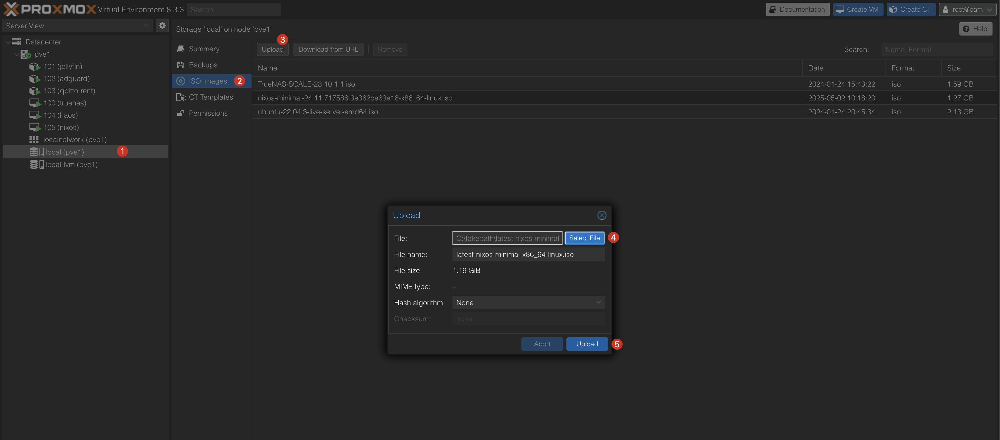

import { Steps } from "@astrojs/starlight/components";

## Download the NixOS ISO

<Steps>

1. Go to the [NixOS download page](https://nixos.org/download/). Or follow this [link](https://channels.nixos.org/nixos-24.11/latest-nixos-minimal-x86_64-linux.iso) to directly download the latest minimal iso image (64-bit Intel/AMD).

2. Choose the appropriate version (e.g., `64-bit Intel/AMD`) and download it.

3. Save the ISO file to a location on your local machine.

4. Verify the checksum of the downloaded ISO file to ensure its integrity. You can find the checksums on the NixOS download page or you can follow this [link](https://channels.nixos.org/nixos-24.11/latest-nixos-minimal-x86_64-linux.iso.sha256).

5. Use the following command to verify the checksum:

   ```bash
   sha256sum /path/to/nixos-minimal-24.11.718051.9b5ac7ad4529-x86_64-linux.iso
   ```

6. Compare the output with the checksum provided on the NixOS download page.

   ```bash
    curl -L https://channels.nixos.org/nixos-24.11/latest-nixos-minimal-x86_64-linux.iso.sha256
    cadf4ae9c8c20653c80db9fcb19cf0af1abae9f10ed6fe2acbc8d2347ba85a0f  nixos-minimal-24.11.718051.9b5ac7ad4529-x86_64-linux.iso

    sha256sum nixos-minimal-24.11.718051.9b5ac7ad4529-x86_64-linux.iso
    cadf4ae9c8c20653c80db9fcb19cf0af1abae9f10ed6fe2acbc8d2347ba85a0f  nixos-minimal-24.11.718051.9b5ac7ad4529-x86_64-linux.iso
   ```

7. If they match, the ISO file is valid.

8. If they don't match, re-download the ISO file and verify again.

</Steps>

:::note[Alternative]

Alternatively you can follow this guide on how to upload the ISO image directly from the Proxmox web interface.

[Proxmox upload ISO image](https://www.thomas-krenn.com/en/wiki/Proxmox_upload_ISO_image)

:::

## Upload the ISO to Proxmox

<Steps>

1. Select your desired storage (e.g., `local`) in the Proxmox web interface.

2. Click on `ISO Images` in the left sidebar.

3. Click on the `Upload` button in the top left corner.

4. In the upload dialog, select the NixOS ISO file you downloaded earlier.

5. Click `Upload` to start the upload process.

   

</Steps>

:::tip

You can verify the checksum of the uploaded ISO file in the upload dialog if you're not at ease with the command line.

:::

---

<details>
  <summary>
    <strong>References</strong>
  </summary>

  <ul>
    <li><a href="https://www.thomas-krenn.com/en/wiki/Proxmox_upload_ISO_image" target="_blank" rel="noopener noreferrer">Proxmox upload ISO image</a></li>
    <li><a href="https://serverdecode.com/upload-iso-proxmox/" target="_blank" rel="noopener noreferrer">How to upload ISO files to Proxmox</a></li>
  </ul>
</details>
